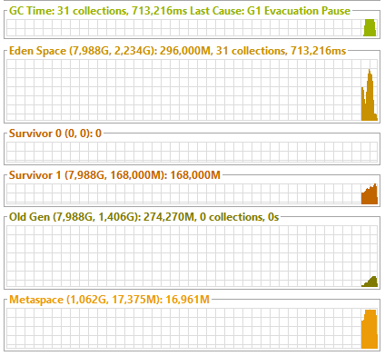

# Lesson 15 #
## Задание 1 ##

    По JIT:
Сделать цикл на 100000 итераций, в цикле в предварительно созданную Map<Integer, String> 
сложить ключ - индекс, значение - "value" + индекс

Запустить с опцией -XX:+PrintCompilation, проанализировать информацию в консоли.  
Запустить с опцией -XX:+PrintCompilation -XX:+UnlockDiagnosticVMOptions -XX:+PrintInlining , 
проанализировать информацию в консоли

    Реализация:
java -XX:+PrintCompilation  Task1.java  

`135   74       3       java.util.HashMap::putVal (300 bytes)` 
`135   82       3       java.util.HashMap$HashIterator::nextNode (100 bytes)` 
`135   73       3       java.util.HashMap$HashIterator::hasNext (13 bytes)` 
`137   88       4       java.lang.String::hashCode (60 bytes)`  
`***` 
`146  108       4       java.util.HashMap::putVal (300 bytes)`  
`***`  
`155   74       3       java.util.HashMap::putVal (300 bytes)   made not entrant`  

Метод putVal был скомпилирован на уровне 3, затем на уровне уровня 4 он был дополнительно оптимизирован 
и был сделан не входящим для 3-го уровня. Это означает, что он будет заменен кодом с 4-го уровня.

java -XX:+PrintCompilation -XX:+UnlockDiagnosticVMOptions -XX:+PrintInlining Task1.java  
`@ 23   java.util.HashMap::hash (20 bytes)   inline`  
`@ 25   java.lang.SecurityManager::checkPermission (5 bytes)   no static binding` 
`@ 9   java.util.HashMap::putVal (300 bytes)   callee is too large` 
Показывает встроенные методы.
Сообщение вызываемый объект слишком велик означает, что вызываемый метод слишком велик, чтобы его можно 
было встроить в вызывающий объект.

## Задание 2 ## 
    По GC:
Из %JAVA_HOME%\bin запустить jvisualvm, установить через пункт меню Tools\Plugins\Available Plugis 
плагин: Visual GC.  
Запустить приложение создающее много объектов с разными GC, посмотреть в jvisualvm как заполняются 
объекты в разных областях памяти(heap).

    Реализация:
java -XX:+UseSerialGC Task2.java  
serial = 216 collections, 10.5s 

java -XX:+IgnoreUnrecognizedVMOptions -XX:+UseConcMarkSweepGC Task2.java  
ConcMarkSweep = 31 collections, 713.2ms  

java -XX:+UseG1GC Task2.java  
G1 = 30 collections, 657.9ms  

java -XX:+IgnoreUnrecognizedVMOptions -XX:+UseParallelOldGC Task2.java  
ParallelOldGC = , 31 collections, 687.1ms  

java -XX:+UseParallelGC Task2.java 
ParallelGC = 21 collections, 1.253s  

